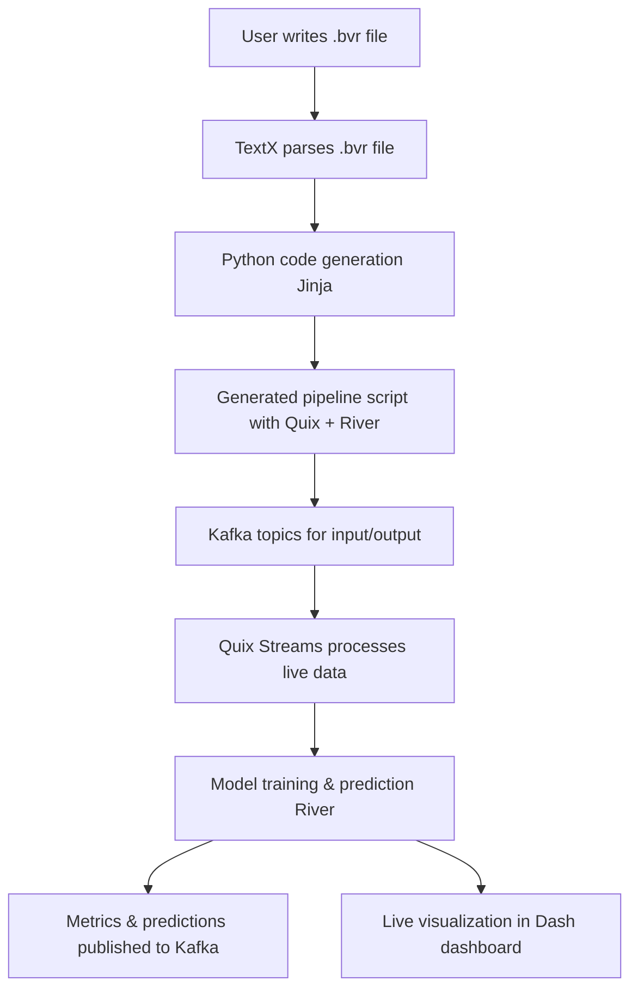

# Beaver 🦫

Beaver is DSL for Machine Learning in live data. It's purpose is to simplify the process of data retrieval and preprocessing, model training, model prediction and output display. It uses multiple tools to achieve this:

- Kafka
- Quixstreams
- River
- Plotly
- Dash
- Docker
- TextX
- Jinja

## Documentation

You can find full description of the language as well as examples and FAQ in the documentation page

## Quickstart

To download the project run :

```bash
git clone https://github.com/deepblue597/thesis.git
```

When you finished downloading go to the repository by running

```bash
cd thesis
```

Create a new virutal environment:

```bash
python -m venv <YOUR-VENV-NAME>
```

Activate the environment

Depending on your shell:

```bash
<YOUR-VENV-NAME>\Scripts\activate
```

PowerShell:

```bash
<YOUR-VENV-NAME>\Scripts\Activate.ps1
```

To download all the necessary libraries run:

```bash
pip install -e .
```

Open a Text Editor of your choice and create a `.bvr` file.
If you are unsure how to structure a `.bvr` you can check the docs or use one of the examples that are provided in the `examples` folder.

When you have added the necessary entities and constructed your pipeline:

1. Open a terminal
2. Run

```bash
python3 gen.py --metamodel <PATH-TO-YOUR-METAMODEL> --generated_file_name <PATH-TO-THE-GENERATED-FILE>
```

**Note**: Instead of `python3` you may need to run `python` depending on the installment of python in your machine

3. If there are no errors, your python file will have been generated at `<PATH-TO-THE-GENERATED-FILE>`

4. Run your python file `python3 <PATH-TO-THE-GENERATED-FILE>`

## Kafka setup

If you don't have a kafka setup, Beaver provides one with 3 brokers, 3 controllers and a kafka UI provided by provectuslabs
To set it up

1. Go to `kafka_proj` folder `cd kafka_proj`

2. Run the docker compose file `docker compose up -d`

3. Your UI will be on `localhost:8080` the brokers at which you can connect are on `localhost:49092` , `localhost:39092` and `localhost:29092`.

## :eyes: Visual Representation

A visual representation of the process that will be built is displayed below:



## 🤝 Affiliations


